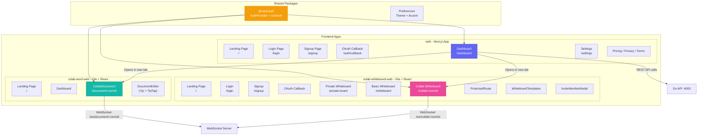
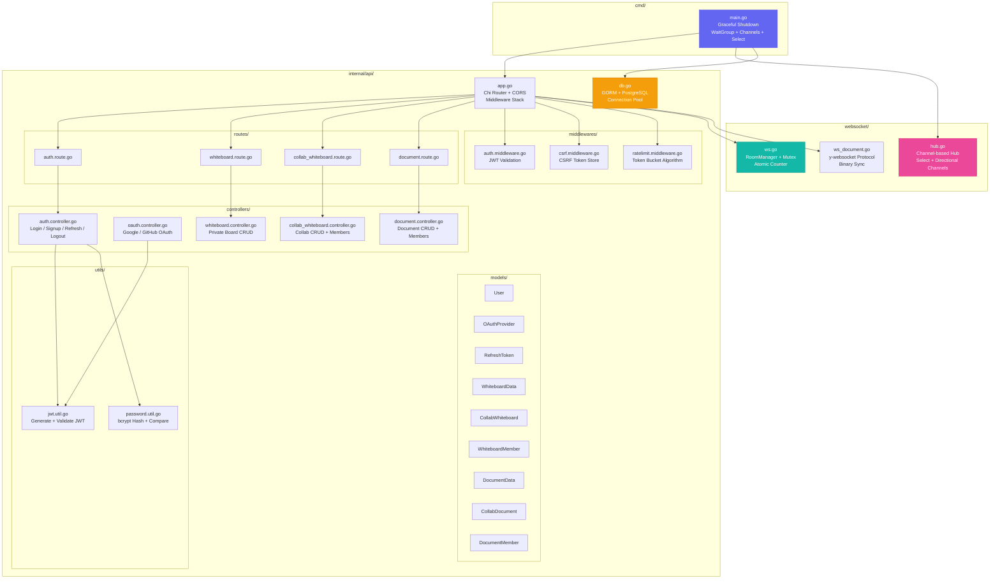
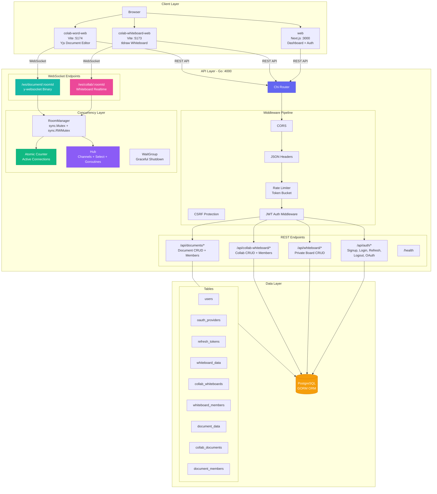
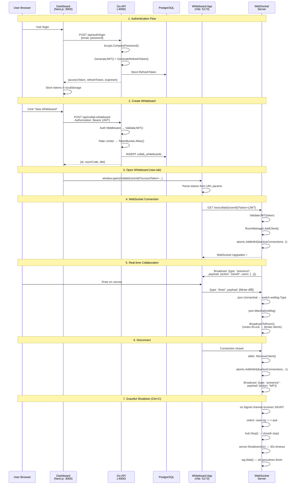

# Collab Platform — Architecture Diagrams

---

## 1. Frontend Architecture — Dashboard & Whiteboard

---

## 2. Backend Architecture (Go API)

---

## 3. Full System Architecture

---

## 4. Request Flow — Collaborative Whiteboard Session

